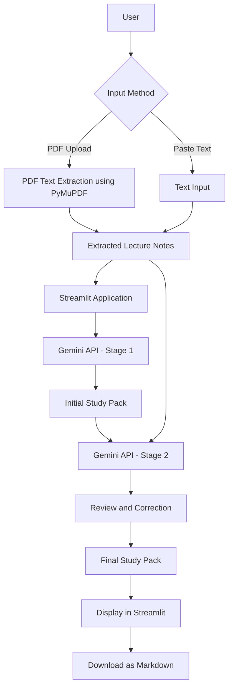
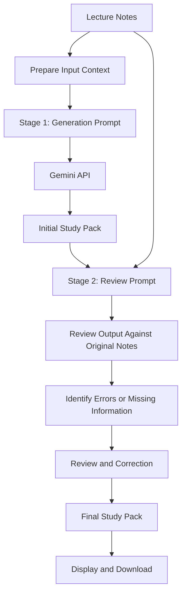
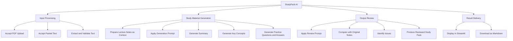
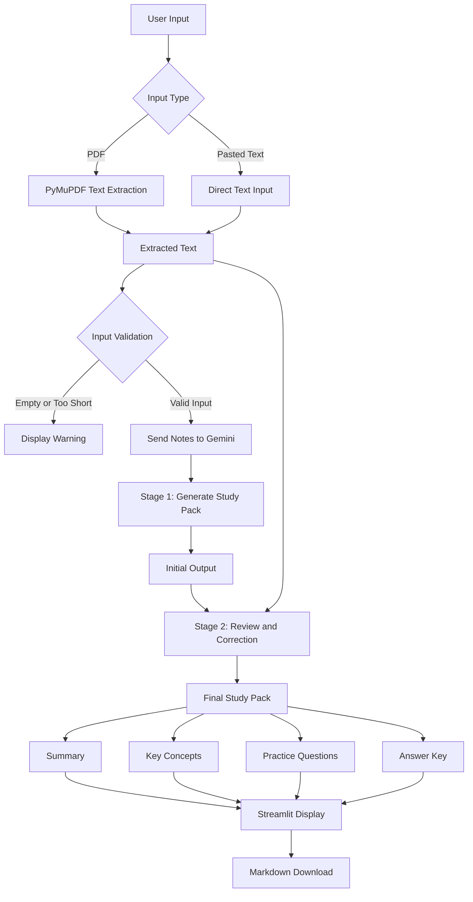

# StudyPack AI - System Architecture and Workflow Diagrams

## 1. System Architecture

```mermaid
flowchart TD
    A[User] --> B{Input Method}
    B -->|PDF Upload| C[PDF Text Extraction using PyMuPDF]
    B -->|Paste Text| D[Text Input]
    C --> E[Extracted Lecture Notes]
    D --> E
    E --> F[Streamlit Application]
    F --> G[Gemini API - Stage 1]
    G --> H[Initial Study Pack]
    H --> I[Gemini API - Stage 2]
    E --> I
    I --> J[Review and Correction]
    J --> K[Final Study Pack]
    K --> L[Display in Streamlit]
    L --> M[Download as Markdown]
```

## 2. Prompt Workflow

```mermaid
flowchart TD
    A[Lecture Notes] --> B[Prepare Input Context]
    B --> C[Stage 1: Generation Prompt]
    C --> D[Gemini API]
    D --> E[Initial Study Pack]
    E --> F[Stage 2: Review Prompt]
    A --> F
    F --> G[Review Output Against Original Notes]
    G --> H[Identify Errors or Missing Information]
    H --> I[Review and Correction]
    I --> J[Final Study Pack]
    J --> K[Display and Download]
```

## 3. Task Decomposition

```mermaid
flowchart TD
    A[StudyPack AI] --> B[Input Processing]
    A --> C[Study Material Generation]
    A --> D[Output Review]
    A --> E[Result Delivery]

    B --> B1[Accept PDF Upload]
    B --> B2[Accept Pasted Text]
    B --> B3[Extract and Validate Text]

    C --> C1[Prepare Lecture Notes as Context]
    C --> C2[Apply Generation Prompt]
    C --> C3[Generate Summary]
    C --> C4[Generate Key Concepts]
    C --> C5[Generate Practice Questions and Answers]

    D --> D1[Apply Review Prompt]
    D --> D2[Compare with Original Notes]
    D --> D3[Identify Issues]
    D --> D4[Produce Reviewed Study Pack]

    E --> E1[Display in Streamlit]
    E --> E2[Download as Markdown]
```

## 4. Input–Output Flow

```mermaid
flowchart TD
    A[User Input] --> B{Input Type}

    B -->|PDF| C[PyMuPDF Text Extraction]
    B -->|Pasted Text| D[Direct Text Input]

    C --> E[Extracted Text]
    D --> E

    E --> F{Input Validation}
    F -->|Empty or Too Short| G[Display Warning]
    F -->|Valid Input| H[Send Notes to Gemini]

    H --> I[Stage 1: Generate Study Pack]
    I --> J[Initial Output]

    J --> K[Stage 2: Review and Correction]
    E --> K

    K --> L[Final Study Pack]
    L --> M[Summary]
    L --> N[Key Concepts]
    L --> O[Practice Questions]
    L --> P[Answer Key]

    M --> Q[Streamlit Display]
    N --> Q
    O --> Q
    P --> Q

    Q --> R[Markdown Download]
```
