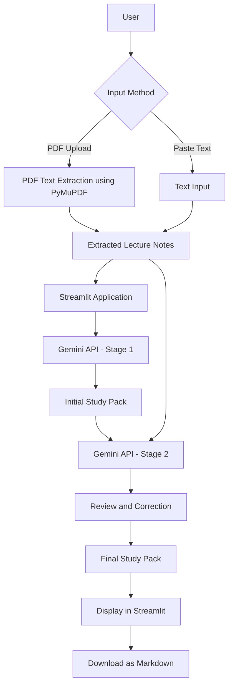

# StudyPack AI — System Architecture

```mermaid
flowchart TD
    A[User] --> B{Input Method}
    B -->|PDF Upload| C[PDF Text Extraction using PyMuPDF]
    B -->|Paste Text| D[Text Input]
    C --> E[Extracted Lecture Notes]
    D --> E
    E --> F[Streamlit Application]
    F --> G[Gemini API - Stage 1]
    G --> H[Initial Study Pack]
    H --> I[Gemini API - Stage 2]
    E --> I
    I --> J[Review and Correction]
    J --> K[Final Study Pack]
    K --> L[Display in Streamlit]
    L --> M[Download as Markdown]
```
